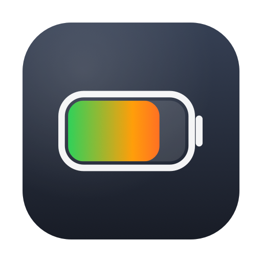
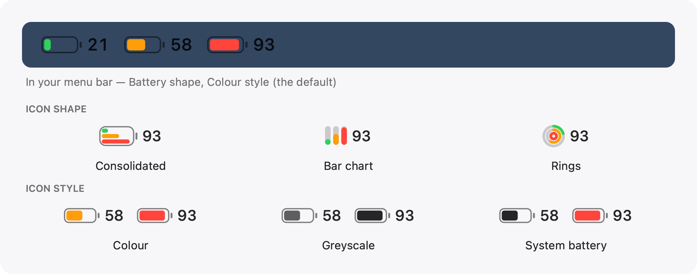

<p align="center"></p>

# Usage Monitor

A tiny macOS **menu-bar app** that shows **multi-provider** AI usage limits
as battery-style gauges — Claude session / weekly / per-model, Grok credits
and product usage, with room for more. Rename providers (“Claude Work”,
“Grok Personal”), badge them with letters (C / G), choose what lands in the
menu bar, and **click any activity row** to jump to that session’s Terminal
tab, Orbit window, or desktop app.

<p align="center">
  <picture>
    <source media="(prefers-color-scheme: dark)" srcset="docs/icons-dark.png">
    
  </picture>
</p>

Green under 50%, amber 50–79%, red at 80%+. Click the item for a labelled
breakdown with reset times, a **Refresh now** button, and **Open at Login**.

The icon is configurable from that menu:

- **Icon Shape** — **Bar chart (vertical)** (default), **Bar chart
  (horizontal)**, **Battery**, or **Rings**.
- **Icon Style** — **Greyscale** (default; level as lightness), **Colour**
  (traffic-light), or **System Battery** (monochrome until the red zone).
- **Density** — **Compact** (default) or **Comfortable**, which draws the
  charts a bit wider for readability.
- **Consolidated Icon** — for the battery shape, stacks all three gauges in one
  glyph, to save menu-bar space.
- **Number Shows** — choose which limit's percentage sits beside the icon: the
  highest by default, or a specific one (Session, All models, or a model).

Each gauge's number is the percent used; the shapes and styles above all show
the same three example gauges (21% / 58% / 93%).

Turn on **Notify near a limit (80%)** in the menu to get a macOS notification
the moment any limit first crosses into the red zone — so you hear about it
without watching the menu bar. It alerts once per crossing and re-arms after the
limit resets below 80%.

The menu has **Active AI** collapsed under a disclosure arrow (so the main menu
stays short):

- **Active AI terminals** — live CLI sessions (what each is working on). Click
  to focus the **existing** Terminal / iTerm tab (by TTY) — not a new window.
- **Active AI desktops** — Claude, ChatGPT, Cursor when the real app is running
  (not Dock helpers). Click to bring it forward.

**Caffeinate Mode** keeps the Mac awake (desktop or laptop). On a MacBook you
can also **keep the laptop on with the lid shut**. While active, a glowing cup
appears in the menu bar — click it for a short reminder (heat / battery notes).
Optional: join a favorite hotspot when turning the mode on.

Under **Providers** you can rename slots, set letter badges, toggle menu-bar
and activity visibility, and add another provider slot. **Menu Bar Layout**
chooses how clusters pack: per-provider letter+%, all gauges, or highest only.

## Stay in the loop

- **Newsletter** — [subscribe for release announcements](https://buttondown.com/jaco)
  (also in the app menu: **Subscribe to Updates…**).
- **Community** — questions, ideas, and show-and-tell live in
  [GitHub Discussions](https://github.com/jackfieldman/usage-monitor/discussions)
  (**Join the Community…** in the app menu).
- The app checks GitHub for releases **about four times a day**. When a new
  version is waiting, **Update available** scrolls across the menu bar **once
  an hour**. Open **Updates** in the menu to install now, turn on **Install
  Updates Automatically**, skip this version, skip all future updates, or pause
  for days/weeks. Updates install only if the download’s code signature matches
  the app’s own Developer ID team.

## Requirements

- macOS 13 (Ventura) or later
- **Claude Code** and/or **Grok CLI** installed and signed in (Codex / Cursor
  optional). Either is enough; both work together. Defaults seed from whatever
  you’re signed into on that Mac. The app reuses the logins those tools already
  store — there's nothing extra to log in to.
- To build from source: Xcode Command Line Tools (`xcode-select --install`).

## Install

### Download (recommended)

Grab the latest signed build from
**[GitHub Releases](https://github.com/jackfieldman/usage-monitor/releases)**
(`UsageMonitor.zip`). Unzip, move `UsageMonitor.app` to `/Applications` if you
like, then open it. The app can update itself from later releases.

### Build from source

```sh
git clone https://github.com/jackfieldman/usage-monitor.git
cd usage-monitor
./build.sh
open UsageMonitor.app
```

On first launch (or any time neither provider is signed in) a **setup window**
walks you through installing Claude Code and/or Grok and signing in. The same
window has an optional **Claude API dollar spend** section — add an Admin API
key and the menu also shows your month-to-date Anthropic pay-as-you-go cost.
You can either let the app **scan your Mac** for a key it already finds (shell
profiles, the `ant` CLI config), or **type one in confidentially** (hidden
field). The key is verified against the cost endpoint before it's saved,
stored only in your macOS Keychain, and used solely to read your cost report.
Reopen setup any time from the menu-bar **Set Up…** item.

Then use **Open at Login** in the menu to have it start automatically. Move
`UsageMonitor.app` to `/Applications` first if you want it to live there.

### From a downloaded build

A signed & notarized build (from the Releases page) opens with a normal
double-click. If you built or received an **unsigned/ad-hoc** copy, macOS
Gatekeeper quarantines it on first open — clear the flag once:

```sh
xattr -dr com.apple.quarantine /path/to/UsageMonitor.app
open /path/to/UsageMonitor.app
```

## How it works

**Claude gauges (subscription usage).** The app reads the OAuth token Claude
Code keeps in your macOS Keychain (`Claude Code-credentials`) and calls the
same endpoint the Claude Code `/usage` panel uses
(`GET https://api.anthropic.com/api/oauth/usage`). It maps the response's
`limits` array to the gauges and polls every 5 minutes. The credential is
strictly **read-only**: the app never refreshes or rewrites the token, because
rotating a refresh token Claude Code also holds can trip the OAuth server's
reuse detection and log Claude Code out. If the token has expired the menu says
so (keeping the last good data); it renews the next time you use Claude Code
and the gauges pick it up on the following poll.

**Grok gauges (credit / product usage).** The app reads the session token Grok
CLI keeps in `~/.grok/auth.json` and calls the same billing endpoint Grok's
`/usage` command uses
(`GET https://cli-chat-proxy.grok.com/v1/billing?format=credits`). It maps
overall `creditUsagePercent` and any product rows with a usage percent
(Build, API, Chat, Imagine) into gauges, and shows the billing-period reset
time. Also **read-only**: Grok owns token refresh; an expired session shows
in the menu and recovers the next time you use Grok. Polls on the same
5-minute cadence as Claude.

**Claude Code activity.** Every Claude Code CLI session writes its own
transcript to `~/.claude/projects/<project>/<session>.jsonl`, including the
project path, git branch, and Anthropic's own token-usage numbers for every
turn. The app rescans these files every 10 seconds — a session with an
unanswered turn (no `turn_duration` marker yet) shows as **Live**; otherwise
it shows how long ago it was last active. It never reads message content,
only this per-turn metadata, and every file is read incrementally (only the
bytes appended since the last scan), so it stays cheap even for long-running
sessions.

**Grok activity.** Grok CLI maintains `~/.grok/active_sessions.json` and
per-session `summary.json` files under `~/.grok/sessions/`. The app reads
only that registry metadata (cwd, pid, last active, branch, model) every
10 seconds — a session whose process is still alive shows as **Live**. No
chat content is read and no network call is made for activity.

**Dollar spend (optional, Anthropic API only).** If you add an Admin API key,
the app calls the Console Admin API
(`GET https://api.anthropic.com/v1/organizations/cost_report`) once per poll,
sums the current month's buckets, and shows the total in the menu. This is
separate from subscription usage — it reflects metered pay-as-you-go API
billing, so it only shows anything if you have an API organization. The Admin
key is stored in its own Keychain item (`UsageMonitor-admin-key`), entered via
a hidden field or picked from a masked list of keys already on your Mac, and
sent only to Anthropic over HTTPS.

### Privacy

Your tokens and usage data never leave your Mac except in requests to
Anthropic's and xAI's own servers — the same servers Claude Code and Grok
already talk to. There is no third-party server, telemetry, or analytics.
Activity sections make no network requests at all — they only read local
files those CLIs already wrote. If you add an Admin API key, it lives only
in your macOS Keychain, is never written to disk or logged, and is sent only
to Anthropic over HTTPS to read your cost report.

Once a day the app also asks GitHub for the latest release
(`api.github.com/repos/jackfieldman/usage-monitor/releases/latest`) so it can
offer you updates. That's an anonymous HTTP request — nothing about you or
your usage is sent.

### ⚠️ Unofficial

This is not affiliated with or endorsed by Anthropic or xAI. It relies on
**undocumented** internal endpoints either company can change or remove at
any time, which would stop the gauges from updating until the app is updated.
It also isn't an investment/billing tool — it only mirrors what each CLI's
`/usage` view shows.

## Uninstall

```sh
pkill -x UsageMonitor          # quit it
# turn off "Open at Login" from the menu first, or:
rm -rf /path/to/UsageMonitor.app
```

The app never installs background services or launch agents; removing the
`.app` is a complete uninstall. It does not delete or alter your Keychain
login — it only ever reads it.

## Colours

| Colour | Meaning        |
|--------|----------------|
| green  | under 50% used |
| amber  | 50–79% used    |
| red    | 80%+ used      |

## License

MIT — see [LICENSE](LICENSE).
